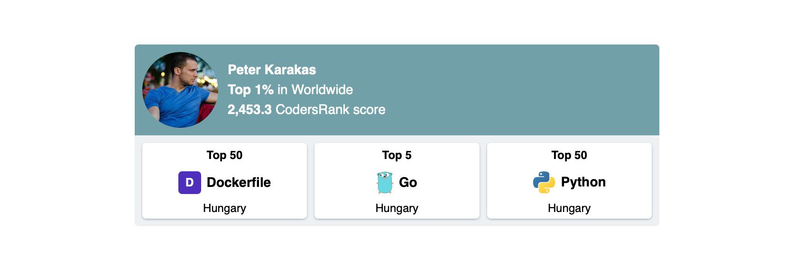

# Codersrank Summary Widget

- [Install from NPM](#install-from-npm)
- [Install from CDN](#install-from-cdn)
- [Usage](#usage)
- [Widget Attributes](#widget-attributes)
- [Styling](#styling)
- [Use As Image](#use-as-image)
- [Contribution](#contribution)
- [Licence](#Licence)

<!-- DOCS_START -->

Codersrank Summary Widget is a web component that allows you integrate widget with your [CodersRank](https://codersrank.io) profile summary to your personal website:



## Install from NPM

Widget script available through NPM:

```
npm i @codersrank/summary --save
```

After installation you need to import and register web component:

```js
import CodersrankSummary from '@codersrank/summary';

// register web component as <codersrank-summary> element
window.customElements.define('codersrank-summary', CodersrankSummary);
```

## Install from CDN

Widget can also be downloaded or linked directly from CDN:

```html
<!-- replace x.x.x with actual version -->
<script src="https://unpkg.com/@codersrank/summary@x.x.x/codersrank-summary.min.js"></script>
```

In this case it is not required to register web component, it is already registered as `<codersrank-summary>` element.

## Usage

As it is a web component the usage is pretty simple, just add widget HTML tag with your [CodersRank](https://codersrank.io) username

```html
<codersrank-summary username="YOUR_USERNAME"></codersrank-summary>
```

## Widget Attributes

Widget supports following properties as HTML element attributes:

| Name              | Type      | Default  | Description                                                                                                                                                      |
| ----------------- | --------- | -------- | ---------------------------------------------------------------------------------------------------------------------------------------------------------------- |
| `username`        | `string`  |          | Your [CodersRank](https://codersrank.io) username                                                                                                                |
| `layout`          | `string`  | `'auto'` | Defines the layout of the widget badges. Can be `auto`, `vertical` or `horizontal`. If `auto` (by default) it will use horizontal layout if it has enough space. |
| `badges`          | `number`  | `3`      | Number (from `0` to `3`) of highlighted badges to display.                                                                                                       |
| `show-avatar`     | `boolean` | `true`   | Defines whether to show avatar or not                                                                                                                            |
| `show-header`     | `boolean` | `true`   | Defines whether to show widget header or not                                                                                                                     |
| `min-width`       | `number`  | `300`    | Widget minimum width for `auto` layout to change widget layout from horizontal to vertical                                                                       |
| `badge-min-width` | `number`  | `100`    | Badge minimal width to change badge inner layout from horizontal to vertical layout                                                                              |
| `branding`        | `boolean` | `true`   | Displays "Powered by CodersRank" link                                                                                                                            |

For example:

```html
<codersrank-summary username="YOUR_USERNAME" layout="vertical"></codersrank-summary>
```

## Styling

It is possible to customize widget colors with CSS Custom Properties (CSS Variables) by setting them directly on the widget element with style attribute or in CSS.

There are following CSS Custom Properties are available:

| Property                         | Value                                |
| -------------------------------- | ------------------------------------ |
| `--bg-color`                     | `#edf1f3 `                           |
| `--border`                       | `none `                              |
| `--border-radius`                | `4px `                               |
| `--header-padding`               | `8px `                               |
| `--header-bg-color`              | `#72a0a8 `                           |
| `--header-text-color`            | `#fff `                              |
| `--avatar-size`                  | `80px `                              |
| `--name-font-size`               | `inherit `                           |
| `--name-font-weight`             | `bold `                              |
| `--rank-font-size`               | `inherit `                           |
| `--preloader-color`              | `#72a0a8 `                           |
| `--badges-padding`               | `8px `                               |
| `--badge-border-radius`          | `4px `                               |
| `--badge-bg-color`               | `#fff `                              |
| `--badge-box-shadow`             | `0px 1px 2px rgba(23, 36, 50, 0.3) ` |
| `--badge-border`                 | `none `                              |
| `--badge-margin`                 | `8px `                               |
| `--badge-padding`                | `4px `                               |
| `--badge-text-color`             | `#000 `                              |
| `--badge-rank-font-size`         | `0.85em `                            |
| `--badge-rank-font-weight`       | `bold `                              |
| `--badge-icon-size`              | `24px `                              |
| `--badge-technology-font-weight` | `600 `                               |
| `--badge-technology-font-size`   | `inherit `                           |
| `--badge-technology-font-weight` | `600 `                               |
| `--badge-technology-font-size`   | `12px `                              |
| `--badge-location-font-size`     | `0.85em `                            |
| `--badge-location-font-weight`   | `normal `                            |
| `--branding-text-color`          | `inherit `                           |

For example, to change header background color to `white` and name font-size to `20px`, add this to CSS stylesheet:

```css
codersrank-summary {
  --header-bg-color: #fff;
  --name-font-size: 20px;
}
```

## Use As Image

It is also possible to insert Summary widget as an image. It is useful in places where you can't integrate web component, or for example on your GitHub profile README.md page.

Image URL is the following:

```
https://cr-ss-service.azurewebsites.net/api/ScreenShot?widget=summary&username=YOUR_USERNAME
```

It accepts all widget attributes as query string parameters, plus one extra parameter:

| Name    | Type     | Default | Description                                                                                                                                                                     |
| ------- | -------- | ------- | ------------------------------------------------------------------------------------------------------------------------------------------------------------------------------- |
| `width` | `number` | `480`   | Width of widget element (generated image). Note that generated image has @2x pixel density, so the PNG image will be actually generated in @2x size from the one specified here |
| `style` | `string` |         | `style` attribute value (here you can specify all CSS variables)                                                                                                                |

For example:

```html

```

Note that you need to URL Encode some of the characters, for example `#` should be `%23` and `#ff0` color should be specified as `%23ff0` in query.

## Contribution

Yes please! See the [contributing guidelines](https://github.com/codersrank-org/summary-widget/blob/master/CONTRIBUTING.md) for details.

## Licence

This project is licensed under the terms of the [MIT license](https://github.com/codersrank-org/summary-widget/blob/master/LICENSE).
